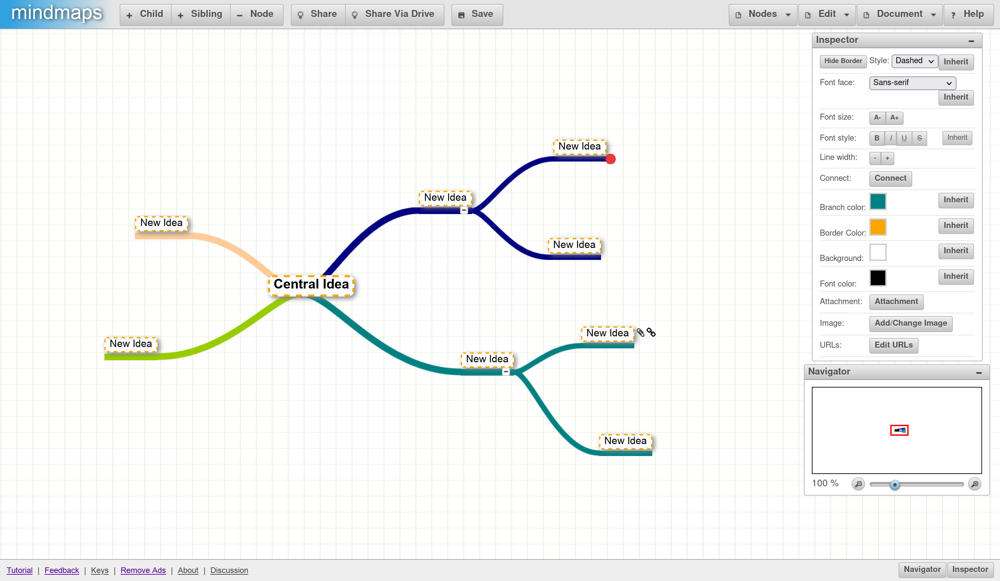

<!--
N.B.: This README was automatically generated by https://github.com/YunoHost/apps/tree/master/tools/README-generator
It shall NOT be edited by hand.
-->

# Mindmaps for YunoHost

## Overview

Mindmaps is a HTML5 based mind mapping application. It lets you create neat looking mind maps in the browser.

**Demo:** https://app.mindmapmaker.org/

## Screenshots

## Documentation and resources

* Official app website: <https://app.mindmapmaker.org>
* Upstream app code repository: <https://github.com/bmp/mindmapper_ynh>
* Report a bug: <https://github.com/bmp/mindmapper_ynh/issues>

**More info regarding app packaging:** <https://yunohost.org/packaging_apps>
